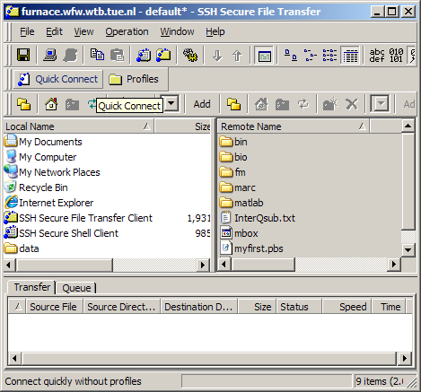
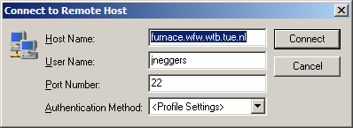
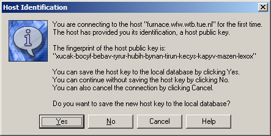
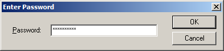
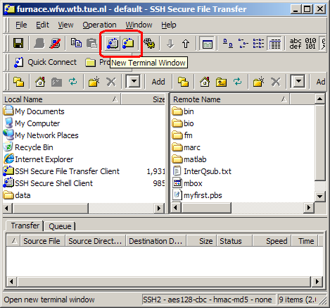
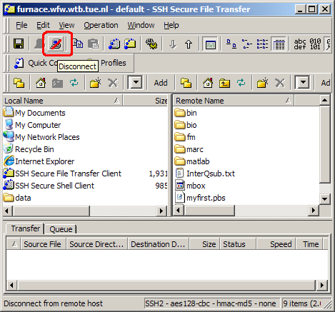

:tocdepth: 3

#############
MaTe clusters
#############

.. contents:: **Outline**
  :local:
  :depth: 2
  :backlinks: top

.. topic:: Practicalities

  * An account on (one of) the clusters can be obtained from `Leo Wouters <L.H.G.Wouters@tue.nl>`_ (GEM-Z 4.17).

  * Questions can be directed to:

    - `Leo Wouters <L.H.G.Wouters@tue.nl>`_

    - `MaTeCluster@tue.nl <MaTeCluster@tue.nl>`_

There are several clusters available in the MaTe group, and many more will come at some point after writing this document. Therefore, this manual uses the *furnace* cluster as an example without going into detail about the other clusters. The *furnace* cluster consists of the following resources:

* 1 head node with 2 quad core Opteron processors, 16 GB RAM and 4.5 TB RAID5 storage.

* 11 AMD Opteron nodes, each with 4 Opteron 8431 hexa-core processors (i.e. 24 cores per node) 2.4 GHz with 128 GB RAM and 250 GB disk.

* 22 Intel Xeon X5550 nodes, each with 2 Nehalem quad-core processors (i.e. 8 cores per node, presenting itself as 16 cores due to hyperthreading) 2.6 GHz with 48 GB RAM and 250 GB disk.

* The Intel cores are faster than the AMD cores and are therefore the best choice for single core jobs.

* The AMD nodes have more cores and memory on one node making them ideal for parallellization.

.. note::

  "Processor" refers to the physical piece of chip, i.e, to the object you buy. However, most processors have more computation units referred to as "cores".

The *furnace* cluster has the following host-name:

.. code-block:: bash

  furnace.wfw.wtb.tue.nl

It, and all the other clusters, can be reached from within the TU/e network (including VPN). Within the MaTe network, the ``.wfw.wtb.tue.nl`` part of the host-name may be omitted. In the following examples we only use the abbreviated form. The clusters host a website (which can only be reached from within the MaTe network) where they present statistics about currently running jobs. For *furnace*:

`http://furnace.wfw.wtb.tue.nl/ganglia <http://furnace.wfw.wtb.tue.nl/ganglia>`_

Basic cluster layout
--------------------

The basic layout of a cluster is shown in the image below. The cluster consists of a *head-node* and several *compute-nodes*. The head-node is the "computer" you log in to from your own PC. From the head-node, jobs are distributed to the compute-nodes by a scheduler: the *queuing system*. The scheduler sends the job to a compute-node when a free spot with the requested resources is available. Running a job thus corresponds to submitting a special (Bash-)script to the scheduler. You don't know a-priori when, or on which compute-node, your job will be handled.

Connecting, File Transfer and Editing
-------------------------------------

The clusters run on Linux and you interface to them using a service called "ssh", which is short for Secure SHell. This service can present a remote Command Line Interface (CLI) over a network. In Layman's terms, *it allows you to type commands from your own computer which are executed on the cluster*. An ssh-client is therefore needed, which can be obtained for any operating system.

Additionally, before and after running a job, the relevant files have to be transferred to and from the cluster respectively. Below we discuss several interfaces for either Linux/Mac or Windows users. It is remarked that generally copying actions/commands run on the users' computer, not on the cluster.

For each user a personal "home" folder is created on the head-node at ``/home/username``. This folder sits on a 4.5 TB Raid-6 disk-cluster, which seems like a lot, but this space is shared by all users. The same "home" folder is mounted on each compute-node on the same location, i.e. ``/home/username`` over network. As a result, the files you have in your home folder on the head-node will automatically be available on each compute-node, although the read/write speed is limited by the network connection.

.. note::

  Your personal disk usage can be checked by issuing ``du -sh`` in your home folder, the total disk usage can be checked with ``df -h`` (the line with ``/state/partition1``). Further reference:

  * :ref:`sec-bash`

  * :ref:`etiquette`

Connecting and File Transfer from Windows
^^^^^^^^^^^^^^^^^^^^^^^^^^^^^^^^^^^^^^^^^

To connect to the cluster from Windows, first a ssh-client is required. Several options exist, for example:

* `SSH Secure Shell (shareware) <http://software.sites.unc.edu/shareware/#s>`_ (often pre-installed by the university's ICT services). See example: :ref:`mate-windows-ssh`.

* `PuTTy (free) <http://www.putty.org/>`_.

* `cygwin (free) <https://www.cygwin.com/>`_: provides a Linux-like environment on Windows. After installing follow the steps for :ref:`mate-windows-linux`.

* `git (free) <https://git-scm.com/download/win>`_. Git is actually a version management system, but it also includes a BASH-shell on Windows. After installing follow the steps for :ref:`mate-windows-linux`.

* `FileZilla (free) <https://filezilla-project.org/>`_ can be used to transfer files to and from the clusters. See example: :ref:`mate-windows-filezilla`.

.. _mate-windows-ssh:

SSH Secure Shell
""""""""""""""""

.. note::

  Download as shareware available from the `University of North Carolina <http://software.sites.unc.edu/shareware/#s>`_. Additional information can be found on their `website <http://sils.unc.edu/it-services/servers/using-ssh>`_.

Connecting
::::::::::

To log-in to the cluster, open the software (either the SSH Secure Shell Client or the SSH Secure File Transfer Client) and hit the *Quick Connect* button.

In the pop-up menu the *Host Name* and the *User Name* should be set, then press *Connect*.

The first time, the software asks to confirm that this computer you are connecting to is the one you expect, confirm the question with *Yes*.

Finally enter your password

File transfer
:::::::::::::

The SSH-Client comes with two window types the SSH Secure Shell Client or the SSH Secure File Transfer Client. The Shell Client is useful for running commands on the cluster, i.e. as a Command Line Interface. The Transfer Client is useful to copy files between your computer and the cluster. Moreover, these two windows can be quickly accessed from the two buttons in the toolbar:

Disconnecting
:::::::::::::

Note the *disconnect* button in the toolbar.

.. note::

  Be sure to use this before closing the program, otherwise an instance of ssh will keep running on the cluster for every time you exit without disconnecting.

.. _mate-windows-filezilla:

FileZilla
"""""""""

FileZilla provides an intuitive filebrowser. It consists of two sides, one for the local PC and the other for the remote host (the cluster). Files can be transferred in both directions.

1.  Add the cluster using the "Site Manager". In this case *rng* is used as example.

    .. image:: ../images/FileZilla_1_open_site_manager.png
      :width: 500 px

    .. image:: ../images/FileZilla_2_site_manager.png
      :width: 500 px

2.  Connect to the cluster.

    .. image:: ../images/FileZilla_3_quick_connect.png
      :width: 500 px

3.  After you are done, disconnect.

    .. image:: ../images/FileZilla_4_disconnect.png
      :width: 500 px

    .. note::

      Be sure to use this before closing the program, otherwise an instance of ssh will keep running on the cluster for every time you exit without disconnecting.

.. _mate-windows-linux:

Connecting and File Transfer from Linux/Mac
^^^^^^^^^^^^^^^^^^^^^^^^^^^^^^^^^^^^^^^^^^^

Connecting
""""""""""

Almost all Linux/Mac distributions have a ssh-client installed. To login to the *furnace* cluster, open a terminal window on your own computer, and execute:

.. code-block:: bash

  [username@mypc ~]$  ssh myclusteraccount@furnace

.. note::

  Do not forget to change ``myclusteraccount`` into your own user-name. Note also that from outside the MaTe-domain (e.g. on the VPN-network) the following command should be used:

  .. code-block:: bash

    [username@mypc ~]$  ssh myclusteraccount@furnace.wfw.wtb.tue.nl

If this is the first time, ssh will ask you to confirm the identity of the computer you are connecting to. Confirm the question, and enter your password to log-in on the *furnace*.

To avoid the need to provide the user's password on each login, a key can be generated on the host computer and provided to the cluster. If still logged-in on the *furnace*, hit ``Ctrl-D`` or type ``exit`` to log-out and return to your own computer. Then follow these steps:

1. Generate a key on your own computer:

   .. code-block:: bash

     [username@mypc ~]$  ssh-keygen -t dsa

   confirm each question with ``Return``.

2. Copy the key to the cluster with:

   .. code-block:: bash

     [username@mypc ~]$  ssh-copy-id myclusteraccount@furnace

If done right, from now on logging in will be password-less.

File transfer
"""""""""""""

There are several file transfer options, partially depending on the Linux/Mac distribution used:

* Using a file browser (e.g. Nautilus for Gnome, or Dolphin for KDE). Open the browser and type ``sftp://myclusteraccount@furnace`` in the address bar (or location bar).

* Using ``scp`` from the command line. This command is completely analogous to the ``cp`` command (see :ref:`sec-bash`). To copy files to the cluster (e.g. *furnace*) type in your local prompt:

  .. code-block:: bash

    [username@mypc ~]$  scp somepath myclusteraccount@furnace:somefurnacepath

  where ``somepath`` (and ``myclusteraccount``) should be replaced. To copy files from the cluster back to the users' computer, the source and the destination should be reversed:

  * if not logged in via ssh on *furnace*:

    .. code-block:: bash

       [username@mypc ~]$  scp myclusteraccount@furnace:someclusterpath somepath

  * if logged in on *furnace* via ssh:

    .. code-block:: bash

       [myclusteraccount@furnace ~]$ scp someclusterpath mypcusername@mypc:somepath

    NB. In this case the connection is reversed (the cluster connects to the user's computer). If a password is prompted, it should be the password of your computer. The login password-less, copy the key from the cluster to your computer (see above).

  Note that to copy folders ``-r`` should be added after ``scp``.

* The more advanced user may want to take a look at the ``rsync`` command, which can perform fast transfer/synchronization.

Editing Scripts
^^^^^^^^^^^^^^^

Here, some basic examples are given to edit files/scripts. There are basically two ways of doing this

1. Copy the file to your own computer, and then edit it with your favorite text/script editor (e.g. with code highlighting), and finally copy the file back to the cluster. This option is recommended for large modifications to a script, and usually is easier to manage in terms of versions.

2. Edit the file on the cluster with an editor which runs in the command line from a shell on the cluster. This option is recommended for small script modifications.

   There are several command line based text editors available on the clusters (and on most other :ref:`sec-linux` machines) named ``vi``, ``emacs``, and ``nano``. The first two are advanced and powerful, but are extremely beginner unfriendly. Luckily, ``nano`` behaves a bit more intuitive, you can start editing a file with ``nano`` by executing:

   .. code-block:: bash

     [username@furnace ~]$  nano myfile.txt

   .. image:: ../images/cm7.png
     :width: 500 px

   When done, press ``Ctrl-X`` to exit, upon which the program ask to save the changes (``Y``) or not (``N``)

   .. image:: ../images/cm8.png
     :width: 500 px

   .. image:: ../images/cm9.png
     :width: 500 px

