:tocdepth: 2

.. _page-queuing:

##################
The queuing system
##################

.. contents:: **Outline**
  :local:
  :depth: 3
  :backlinks: top

The clusters are equipped with a scheduler or queuing system, which distributes the jobs over the cluster's resources. On the MaTe clusters the `TORQUE <http://www.adaptivecomputing.com/products/torque.php>`_ queuing system is installed together with the `Maui <http://www.adaptivecomputing.com/resources/docs/maui/index.php>`_ resource scheduler. This system is very similar to the `PBS <http://en.wikipedia.org/wiki/Portable_Batch_System>`_ queuing system.

Overview
========

The interaction with the queuing system is accomplished using the following commands:

* ``qsub``: issue a job to the queue;

* ``qdel``: delete a job from the queue;

* ``qstat``: get queue status;

* ``qpeek`` followed by the job-id: preview the output file.

Details are found in the manual pages:

.. code-block:: bash

  [username@furnace ~]$  man qsub
  [username@furnace ~]$  man qdel
  [username@furnace ~]$  man qstat

As explained, the queuing system decides which job runs on which compute node. To this end, the user has to specify the resources needed per job. A job in this case is a series of commands (e.g. Bash, Matlab, etc.) which are grouped in a script, often referred to as the PBS-script (as it frequently has the extension ``.pbs``. The resources, and other options of the queuing system, can be specified in two -- equivalent -- ways:

1. as options to the ``qsub`` command
2. in the header of the ``.pbs`` script

All qsub-options are found in the manual page, several common options are shown in :ref:`page-queuing-pbs`.

Monitoring the job is done with the ``qstat`` command. To get all information available of all jobs use the ``qstat -f`` command.

.. note::

  The customized :ref:`monitoring_myqstat` script which is available on the furnace cluster. This script generates more readable reports of the currently running jobs. See also:

  * ``myqstat -h``

  * :ref:`etiquette-monitor-jobs`

.. _page-queuing-pbs:

PBS directives
==============

Several PBS directives are listed here. The next sections cover several useful examples.

=========================== ========================================================================================================================
Option                      Description
=========================== ========================================================================================================================
``-S /bin/bash``            Specify to use the ``bash`` shell on the compute node.
--------------------------- ------------------------------------------------------------------------------------------------------------------------
``-j oe``                   Join the "standard output" and "standard error" streams into the first stream mentioned ("standard output" for the
                            script above)
--------------------------- ------------------------------------------------------------------------------------------------------------------------
``-o pbs.out``              Specify a file name (and location) for the "standard output"
--------------------------- ------------------------------------------------------------------------------------------------------------------------
``-N myjobname``            Specify the job name (also visible in the queue) if not specified it defaults to the file name of the ``.pbs`` script
--------------------------- ------------------------------------------------------------------------------------------------------------------------
``-l nodes=1:ppn=2``        Claim on one node two cores (ppn = processors per node)
--------------------------- ------------------------------------------------------------------------------------------------------------------------
``-l nodes=1:ppn=1:intel``  Claim on one Intel node one core
--------------------------- ------------------------------------------------------------------------------------------------------------------------
``-l nodes=1:ppn=8:amd``    Claim on one AMD node eight cores
--------------------------- ------------------------------------------------------------------------------------------------------------------------
``-l pmem=3gb``             Claim 3 gigabytes of physical memory, however in most cases this option is unnecessary
--------------------------- ------------------------------------------------------------------------------------------------------------------------
``-l pvmem=3gb``            Specifies a maximum virtual (swap) memory of three giga-byte for each process in the job. Specify this option to make
                            sure that your job will not kill other jobs on the same node by using all swap-space
=========================== ========================================================================================================================

.. note::

  The ``pmem`` is used for proper distribution over the different compute-nodes, the ``pvmem`` is used to kill the job if more than the specified amount of memory is used.

.. seealso:

  * ``man qsub`` for the total list of options.

  * ``man pbs_resources`` for all possible resources in the ``-l option``.

My first PBS job
================

Consider this very simple ``.pbs`` script written in Bash:

.. literalinclude:: ../scripts/myfirst.pbs
   :language: bash

:download:`source: myfirst.pbs <../scripts/myfirst.pbs>`

The queuing system reads all lines until the first line not starting with a ``#``. For each line starting with ``#PBS``, the options, called :ref:`page-queuing-pbs`, will be interpreted.

This job can be started using

.. code-block:: bash

  [username@furnace ~]$  qsub myfirst.pbs
  37892.furnace.wfw.wtb.tue.nl

The job is entered to the queuing system and is assigned an ID-number, e.g. ``37892``. The job will be queued, and if a single Intel core is free it will run. The status of the job is monitored using ``qstat``.

.. note::

  The job ends quickly, and then disappears from ``qstat``

To check the result we can look at the stored "standard output":

.. code-block:: bash

  [username@furnace ~]$  cat pbs.out
  /home/username
  Hello world

Multiple core job
=================

Now consider this ``.pbs`` script

.. literalinclude:: ../scripts/parallel.pbs
   :language: bash

:download:`source: parallel.pbs <../scripts/parallel.pbs>`

This script will cause the queuing system to reserve two cores on one compute-node, for the duration of the job. Similar to above, we start the job and check the output

.. code-block:: bash

  [username@furnace ~]$  qsub parallel.pbs
  37893.furnace.wfw.wtb.tue.nl
  [username@furnace ~]$  cat pbs.out
  Hello world

Note that during this job two cores were claimed and reserved. However, this does not mean that two cores were used! The command (i.e. ``echo "Hello world"``) runs as a single process (with one thread) and therefore only uses one core.

.. warning::

  Claiming multiple cores is the easy part of parallelizing your job, the difficult part is getting the program you run to actually use multiple cores. Please keep in mind that every reserved core remains dedicated to the job regardless of whether or not it is actually used; it can therefore not be used by others.

.. _page-queuing-heavyio:

Heavy file-IO job
=================

Each user has a "home" directory on the head node, located at ``/home/username``, or simply ``~``. This directory is mounted on each compute-node at the same location over a network connection. This means that, your data is automatically available on each compute-node, without the need to copy it. However, this also means that all Input/Output (IO) (i.e. reading and writing of files) must pass over the relatively slow network connection. Some jobs use a lot of "file IO" (e.g. MSC Marc or Abaqus) and for these jobs it is better to:

1. Transfer all necessary files to the local hard-drive on the compute-node [network traffic].

2. Execute the job [no network traffic].

3. Transfer the results back to the home folder, which is actually on the head-node [network traffic].

Consider this example ``.pbs`` script (which is executed (only) on the compute-node)

.. literalinclude:: ../scripts/withtransfer.pbs
   :language: bash
   :linenos:

:download:`source: withtransfer.pbs <../scripts/withtransfer.pbs>`

Let us examine several lines of this script:

9.  the username is stored in the variable ``username`` (the used quotes are called back-quotes)

15. the path of a temporary directory is constructed using the username and the unique job id

21. test if the ``$computedir`` location exists or not

22. if it does not exist, create it including any necessary parent directories (``-p`` option)

24. if it does exist, then a previous job (with the same name) accidentally left it lingering, clean the contents and it is ready for re-use

29. change to the directory where qsub was issued, which is typically in the user's home-folder on the head node

31. copy the entire contents to the temporary directory (which is local on the compute-node)

33. change to the temporary directory

28-43. the execute part, the reason why we issued this job, typically some heavy MSC-Marc, Matlab, Fortan, C program

49. change back to the qsub directory (on the head node)

51. copy everything from the temporary directory to here (the ``.`` means here)

53. delete the temporary directory

.. warning::

  If your job fails in any way it will leave your data on the compute-node, please remember to clean it manually (see :ref:`etiquette-monitor-resources-rocks`).

.. note::

    As any other PBS-script, the entire script runs on the compute-node. The only thing that used from the head-node is the hard-drive (mounted on :file:`/home/username/`), specifically before executing the computations (line 38-43) and after completing the computations (line 49-53).

Common pitfalls
---------------

* This script copies all files, folders, and sub-folders in the directory where the ``qsub``-command is executed. It is therefore important that the command is executed in the right directory. It should be as far down as possible, otherwise the script copies too many files.

  For example the simulation is located in ``~/thesis/sim``. It consists of a Python-script ``main.py`` and a similar PBS-script as above in ``job.pbs``. To submit the job:

  .. code-block:: bash

    $ cd ~/thesis/sim
    $ qsub job.pbs

  The script now creates a temporary folder on the relevant compute-node and copies the files ``main.py`` and ``job.pbs`` to it. It then executes and copies all files (including the output-files) back to ``~/thesis/sim``.

  If one would use

  .. code-block:: bash

    $ cd ~
    $ qsub job.pbs

  The script would copy the entire home-folder to the compute-node. This is highly unwanted as it can result in a gigantic file-transfer. Also, it is likely that the script will not run at all.

* Since the file-path is different on the compute-node (because a temporary directory is used) it is essential the relative file-paths are used everywhere in the simulation (see :ref:`sec-bash`). This is always a good idea, but in the case of a temporary directory on the compute-node things may go wrong otherwise.

